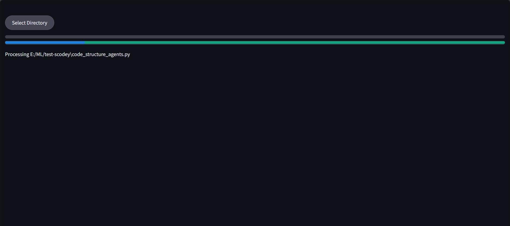
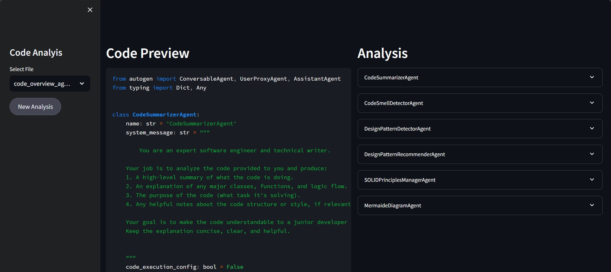
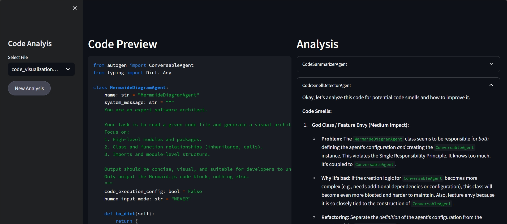

## scodey-code-analyzer

# Scodey

**Scodey** is an intelligent code analyzer powered by [AutoGen](https://github.com/microsoft/autogen) agents and [streamlit](https://github.com/streamlit). It can scan and interpret code files with the help of AI agents, making your development and review process smarter and more efficient.


## Features

- Analyze code using AutoGen agents
- Multi-file support
- Visual feedback via Mermaid

---

## Installation

We recommend using a virtual environment.

### 1. Clone the repo
```bash
git clone https://github.com/DeepActionPotential/scodey-code-analyzer
cd scodey-code-analyzer
```

### 2. Set up a virtual environment
```bash
python -m venv venv
source venv/bin/activate      # on Linux/macOS
venv\Scripts\activate         # on Windows
```

### 3. Install dependencies
```bash
pip install -r requirements.txt
```

---

## Usage

Set your api-key in config file, then run:

```bash
python run.py
```

---

## Demo

### Select a Directory


### Agents analyzing Python files



### agent analysis results





---

## License

This project is licensed under the **MIT License** — see the [LICENSE](LICENSE) file for details.

---

## Contributing

Pull requests are welcome! For major changes, please open an issue first to discuss what you’d like to change.

---

## Credits

- Built  mainly using [AutoGen](https://github.com/microsoft/autogen) and [streamlit](https://github.com/streamlit)


